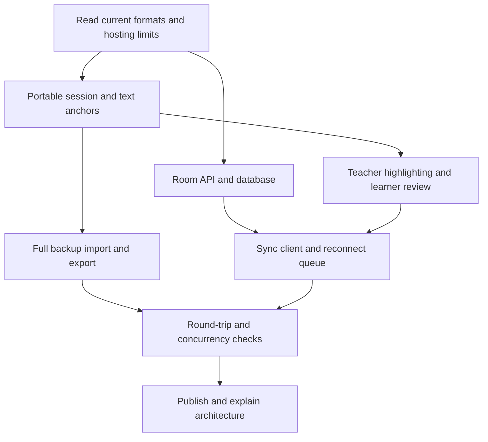

# Shared pronunciation sessions

The existing lesson templates and version 1 lesson files stay compatible.

Owner: primary agent implements and publishes. Independent reviewers inspect the format/restore design and supported hosting architecture, then review the resulting implementation. They do not edit the Site concurrently.

Acceptance:

- Select a word or phrase in Teacher view and save a soft-red pronunciation mark.
- Learner view keeps marks hidden until requested; review lists marks and feedback.
- Two signed-in participants can share one immutable lesson and independently navigate it.
- Learner writing and teacher annotations synchronize without overwriting each other.
- Repeated requests are safe; disconnections retain pending work and show their state.
- A full session export restores content, drafts, notes, checks, choices, highlights and practice state as a separate session.
- Old lesson-only JSON and earlier local drafts still work.
- A teacher invitation grants room membership, but does not bypass the Site audience settings.
- Documentation distinguishes transport, application operations, coordination and persistence.

Implemented and checked: session format/restore, text anchors, teacher/learner controls, room API, durable storage, conflict handling, reconnect queue, backward compatibility and the compact heading. Tests cover two independent DOM contexts and authenticated API participants, with pending work restored before reconnect.

Hosting: private Sites Worker + D1, same Site identity. Teacher Site access requires the teacher's email; the room invitation does not change the hosting audience. Browser visual QA was not requested and was not performed.
